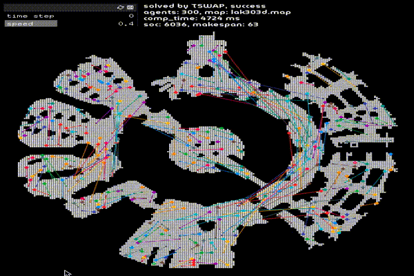

tswap
===
[](LICENCE.txt)

A simulator and visualizer of (offline) Unlabeled Multi-Agent Path Finding (unlabeled-MAPF), used in a paper ["Solving Simultaneous Target Assignment and Path Planning Efficiently with Time-Independent Execution"](https://arxiv.org/abs/2109.04264) (TSWAP, to appear at ICAPS-22).

- It is written in C++(17) with [CMake](https://cmake.org/) build and tested on MacOS 10.15.
- The repository uses [Google Test](https://github.com/google/googletest).
- The visualizer uses [openFrameworks](https://openframeworks.cc).
- The implementations include: the makespan optimal algorithm [1] and TSWAP (sub-optimal, complete).

| platform | status (master) | status (dev) |
| ---: | :--- |:--- |
| macos-10.15 |   |   |
| ubuntu-latest |  |  |

## Demo




## Building

```sh
git clone https://github.com/Kei18/tswap.git --recursive
cd tswap
mkdir build
cd build
cmake ..
make
```

## Usage
TSWAP (sub-optimal complete)
```sh
./app -i ../instances/sample.txt -s TSWAP -o result.txt -v
```

FlowNetwork (makespan optimal, the result is saved in `result.txt`)
```sh
./app -i ../instances/random-32-32-20_70agents_1.txt -s FlowNetwork -v
```

You can find details and explanations for all parameters with:
```sh
./app --help
```

Please see `instances/sample.txt` for parameters of instances, e.g., filed, number of agents, time limit, etc.

### Output File

This is an example output of `../instances/sample.txt`.
Note that `(x, y)` denotes location.
`(0, 0)` is the left-top point.
`(x, 0)` is the location at `x`-th column and 1st row.
```
instance=../instances/sample.txt
agents=100
map_file=arena.map
solver=TSWAP
solved=1
soc=1864
makespan=30
comp_time=91
internal_info=
elapsed_assignment:82
elapsed_path_planning:9
estimated_soc:1602
estimated_makespan:29
starts=(32,21),(18,22),(29,19),(26,24),[...]
goals=(39,4),(23,18),(46,2),(26,26),[...]
solution=
0:(32,21),(18,22),(29,19),(26,24),[...]
1:(32,20),(18,21),(30,19),(26,23),[...]
[...]
```

## Visualizer

### Building
It takes around 10 minutes.

#### macOS 10.x
```sh
bash ./visualizer/scripts/build_macos.sh
```

Note: The script of openFrameworks seems to contain bugs. Check this [issue](https://github.com/openframeworks/openFrameworks/issues/6623). I fixed this in my script :D

#### macOS 11.x
```sh
git submodule update --remote
bash ./third_party/openFrameworks/scripts/osx/download_libs.sh
cd visualizer
make build
cd ..
chmod +x ./visualize.sh
```

### Usage
```sh
cd build
../visualize.sh result.txt
```

You can manipulate it via your keyboard. See printed info.


## Experimental Environment
[](https://github.com/Kei18/tswap/releases/tag/v1.2)

## Utilities

auto formatting with commit (by [clang-format](https://clang.llvm.org/docs/ClangFormat.html))

```sh
git config core.hooksPath .githooks
chmod a+x .githooks/pre-commit
```

## Licence
This software is released under the MIT License, see [LICENCE.txt](LICENCE.txt).

## Notes
- `NaiveTSWAP` is a solver using the pseudo-code in the paper without modifications.
  `TSWAP` uses a priority queue to achieve efficient agents' moves.
- Maps in `maps/` are from [MAPF benchmarks](https://movingai.com/benchmarks/mapf.html).
  When you add a new map, please place it in the `maps/` directory.
- The font in `visualizer/bin/data` is from [Google Fonts](https://fonts.google.com/).
- Scripts for the experiments are in `exp_scripts/`.
- `tests/` include test scripts.
- The implementation of ECBS-TA [2] can be obtained [Wolfgang's excellent repository](https://github.com/whoenig/libMultiRobotPlanning).

## Author
[Keisuke Okumura](https://kei18.github.io) is a Ph.D. candidate at Tokyo Institute of Technology, working on multiple moving agents.

## Reference
1. Yu, J., & LaValle, S. M. (2013).
   Multi-agent path planning and network flow.
   In Algorithmic foundations of robotics X (pp. 157-173). Springer, Berlin, Heidelberg.
2. Hönig, W., Kiesel, S., Tinka, A., Durham, J., & Ayanian, N. (2018).
   Conflict-based search with optimal task assignment.
   In Proc. Int. Joint Conf. on Autonomous Agents and Multiagent Systems (AAMAS).
